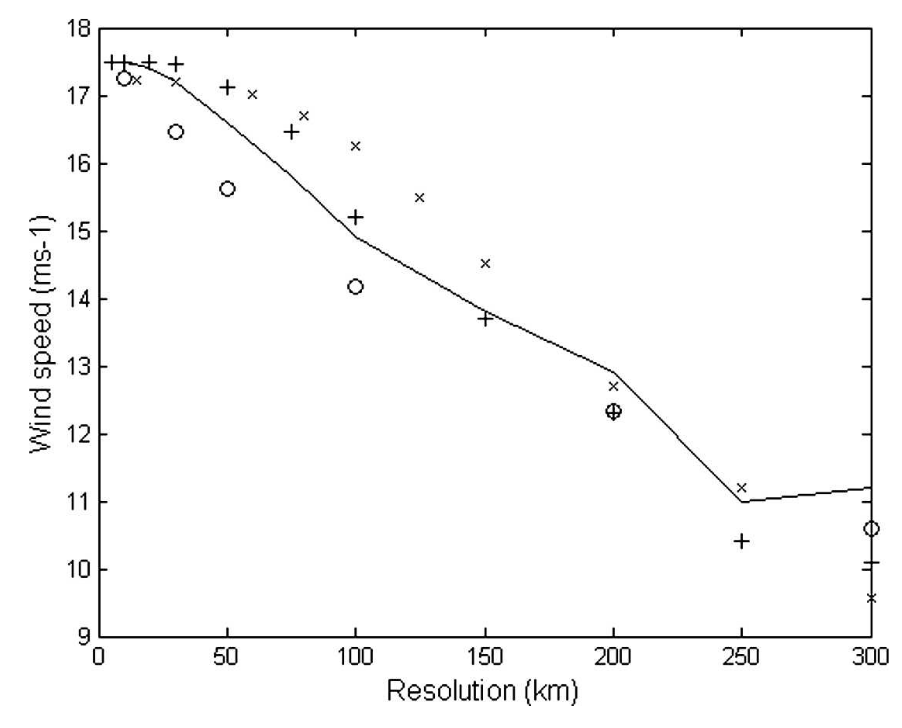

# Methodology

This page describes the methodology used in _pyhanami_ for evaluating model replicability and assessing Earth System Models' (ESMs) ability to reproduce real-world climate phenomena.

## Data preprocessing

<!-- TO DO: add explanation of the intake catalog when implemented.

Moreover, -->
The package includes a `DataChecker` class that verifies the integrity and consistency of the input datasets (both simulations and observations) before any analysis is performed. This ensures that the data meets the required standards and formats, reducing the likelihood of errors during processing. It checks for:

- **Standard compliance**: names and format of coordinates (`time`, `lat`, `lon`), and variables’ attributes (`long_name` and `units`).
- **Spatial completeness**: no NaN values present in atmosphere variables, and at least one (but not all) NaN value in the ocean variables.
- **Temporal completeness**: all timesteps present between the minimum and maximum time values.
- **Physical plausibility**: all variables lie within the established ranges and boundaries defined in `src/pyhanami/config/variables.yaml`.

## Diagnostic visualizations

This section provides an overview of how the data is prepared and processed for the diagnostic visualizations implemented within the `DataDiagnostics` class.

First of all, the package includes methods to create **time series** plots for a given climate variable. For these, the data is spatially averaged with area weights (based on latitude) to obtain global mean time series. The time series can be computed as annual, monthly or daily means. Given a simulation ensemble, the time series are first calculated for each ensemble member, and then the ensemble mean is plotted together with the 2.5%, 5%, 95% and 97.5% percentiles. Besides, the trajectories of individual members can be included in the plot.

Additionally, the package allows to generate spatial comparisons between different datasets for a given climate variable. These include comparisons between simulations datasets:
- **Absolute difference**: absolute average difference between two datasets at the grid point level. Before computing the difference, the mean over time and the mean over ensemble members (if the datasets contain multiple ensemble members) are calculated.
- **Effect size (Cohen's $d$)**: effect size between two datasets at the grid point level. This is taken as Cohen's effect size ($d$), computed as
    
    $$
    d = \frac{\mu_1 - \mu_2}{\sigma},
    $$
    
    where μ₁ and μ₂ are the means of the two datasets taken over the ensemble members (after averaging over time), and σ is the pooled standard deviation. The pooled standard deviation is calculated as
    
    $$
    \sigma = \sqrt{\frac{(n_1 - 1)\sigma_1^2 + (n_2 - 1)\sigma_2^2}{n_1 + n_2 - 2}},
    $$

    where $\sigma_1$ and $\sigma_2$ are the standard deviations of the two datasets taken over the ensemble members (after averaging over time), and $n_1$ and $n_2$ are the number of samples (ensemble members) in each dataset.

    Note that the effect size is not computed just once for all the ensembles members. Instead,  bootstrapping is used to compute the effect size multiple times, generating a distribution of effect sizes. The mean of this distribution is taken as the final effect size value. Moreover, a _t_-test is performed to assess whether the differences between the two datasets are statistically significant at the grid point level.

And comparisons between simulations and observations:
- **Bias**: average difference between the datasets at the grid point level. Before computing the difference, the mean over time and the mean over ensemble members (if the simulated dataset contains multiple ensemble members) are calculated.

## Replicability

This section describes the statistical approach implemented within the `ReplicabilityTest` class to assess the replicability of ESMs. The aim of the test is to evaluate whether two sets of simulated ensembles are statistically indistinguishable with a given significance level (see ([[Preprint] K. Keller et al., 2025](https://egusphere.copernicus.org/preprints/2025/egusphere-2025-1367/)) for a more detailed description of the methodology).

For clarity, in this and the following section, we use the term **metric** to refer to descriptive quantitative statistices, indicators, or figures of merit derived from climate data (e.g., the number of Tropical Cyclones (TCs) detected per month); while **score** is used to denote scalar values derived from these metrics to evaluate model performance, typically through comparison with observations or reanalyses (e.g., the spatial correlation between simulated and observed TC counts).

The structure of the test is the following: given two ensembles generated in two different computing environments (e.g., different hardware or software stack), we assign a score to each ensemble member; this results in two distributions of scores (one per computing environment), which are then compared by combining several statistical tests (e.g., the Kolmogorov-Smirnov test) with the null hypothesis that both samples are drawn from the same underlying distribution.

When running an ESM, the surface of the Earth is represented as a grid composed of multiple cells. We use the climatologies (mean values over a span of time) of climate variables at each of these cells to compute the scores for the test. Some of the variables used are the atmospheric air temperature, the precipitation rate, the mean sea level pressure, or the the sea surface salinity. Directly averaging the values of these variables spatially would result in the loss of important information regarding regional differences among the ensemble members. Due to this, we first apply various metrics at the cell level, which compares each member's value against either the mean of the entire simulated ensemble or the mean of a common reference observational dataset. By taking the weighted spatial mean of these cell-level metrics, we obtain scalar scores. Particularly, we combine the outcome of three different scores and evaluate them with four distinct statistical tests, rejecting the null hypothesis whenever at least one of the tests results in a rejection, indicating that there is a significant difference.

As the test is implemented within _pyhanami_, it allows users to test for replicability across a set of climate variables, distinguishing by region:
- Global
- Tropics (latitude below 30º)
- Extratropics (latitude above 30º)

and season:
- All (January–December)
- DJF (December–February)
- MAM (March–May)
- JJA (June–August)
- SON (September–November)

This separation facilitates the identification of more specific issues that may be obscured when averaging the simulation results globally or over the entire year.

Finally, given two ensembles, the results of the replicability tests are summarized in a **matrix plot**, in which each matrix cell represents the comparison between the ensembles for a specific variable, season and region. Particularly, each cell is divided into four triangular sections representing the effect size obtained using various scores, together with a circle in the center indicating the statistical tests outcome:
- Green: no rejection of the null hypothesis (replicable)
- Red: rejection of the null hypothesis (not replicable)

This visualization allows for a quick assessment of the replicability, helping identify variables showing significant differences and seasonal/regional patterns.

## Scientific skill

The `ScientificEvaluation` class implements various plots and scalar scores to analyze how well ESMs reproduce key climate phenomena. These scores compare model output against observational data to quantify the models' skill in capturing specific features of the Earth's climate system.

This section explains the approach used to evaluate several climate phenomena. Currently, the package allows to assess the following phenomena:

### General scalar scores

General scalar scores are computed for a given variable by comparing the simulated data with a reference observational dataset. The scores include:

- **Spatially averaged absolute and relative bias**: computed as

    $$
    \text{BIAS} = \sum_{i=1}^N \widetilde{\omega}_i\cdot |\text{bias}_i|, \quad \text{eBIAS} = \sum_{i=1}^N \widetilde{\omega}_i\cdot e^{-|\text{bias}_{i}|/\sigma^y_i},
    $$

    respectively, where

    $$
    \text{bias}_{i} = \bar{x}_{i} - \bar{y}_i
    $$ 
    
    is the bias between the simulated ($\bar{x}_{i}$) and observed ($\bar{y}_i$) climatological means, $\sigma^y_i$ is the standard deviation over time of the observed variable and $\widetilde{\omega}_i$ is the normalized area weight, all at grid point $i$.

- **Spatially averaged absolute and relative Root Mean Square Error (RMSE)**: computed as

    $$
    \text{RMSE} = \sum_{i=1}^N \widetilde{\omega}_i\cdot \text{crmse}_i, \quad \text{eRMSE} = \sum_{i=1}^N \widetilde{\omega}_i\cdot e^{-\text{crmse}_i/\sigma^y_i},
    $$

    respectively, where 

    $$
    \text{crmse}_{i} = \sqrt{\frac{1}{T}\sum_{t=1}^T [(x_{it}-\bar{x}_{i})-(y_{ti}-\bar{y}_i)]^2}
    $$

    is the centralized RMSE at grid point $i$, and $T$ is the number of time steps.
- **Spatial Pearson correlation coefficient**: computed as

    $$
    r_{xy} = \frac{\text{cov}_w(x, y)}{\sqrt{\text{var}_w(x)\cdot\text{var}_w(y)}},
    $$

    where $\text{cov}_w(x, y)$ is the area-weighted covariance between the simulated and observed climatologies, and $\text{var}_w(x)$ and $\text{var}_w(y)$ are the area-weighted variances of the simulated and observed climatologies, respectively.
<!-- TO DO: add Pcc formula? Or not necessary as it is the general one? -->

When more than one ensemble member is available, the scores are computed for each member and then averaged to obtain a single score for the simulation dataset.

### Tropical IntraSeasonal Oscillation (ISO)    <!-- : Bimodal ISO indices -->

Two separate indices are defined for the **Madden-Julian Oscillation (MJO)** and the **Boreal Summer ISO (BSISO)**, following [(K. Kikuchi, 2020)](https://link.springer.com/article/10.1007/s00382-019-05037-z). These indices capture the ISO behavior during boreal winter and boreal summer, respectively. They are constructed using an Extended Empirical Orthogonal Function (EEOF) analysis of Top of Atmosphere (TOA) Outgoing Longwave Radiation (OLR) data. Projecting the OLR data onto the first two EEOFs results in two Principal Components (PCs) for MJO and two for BSISO, which together represent the **bimodal ISO indices**. The PCs are normalized by one standard deviation of the EEOF analysis period, corresponding to the squared root of the associated eigenvalue. Based on the PCs amplitudes, the mean monthly frequency of MJO and BSISO events (ISO seasonality) is computed. 

<!-- EOFs are spatial patterns showing where things tend to vary together, and they look for the simplest explanation of the most variance (if a dataset could be described with just one pattern, what pattern would capture the most?). The 2nd EOF explains the second-most, and so on, and they are mathematically independent (orthogonal). The whole dataset can be reconstructed by adding a weighted combination of a few EOF pattern. Moreover, each one has an associated time series (PC) which shows when the pattern was active and how strongly. When a dataset contains an oscillatory phenomenon, EOF1 + EOF2 together represent a physical mode, being EOF1 like 'phase 1' and EOF2 like 'phase 2' (90º out of phase); hence, combining them gives a rotating or propagating structure. In this case, the physical meaning is in the pair EOF1 + EOF2, not in each EOF individually. This is very common when both eigenvalues are nearly equal and EOF1 and EOF2 look like the same map but shifted in space, however, for other phenomena, they can also represent two different independent physical modes (ex. global temperature, where EOF1 is the overall warming pattern and EOF2 is the ENSO pattern?). 

On another note, given that if \lambda is an eigenvalue, then -\lambda is also an eigenvalue, the sign of an EOF does not have a physical meaning by itself. It might change depending on the algorithm used. Nevertheless, it is important to note that there is meaningful information in the relative sign struture (i.e. which regions vary together or oppositely). -->

In order to derive scalar scores, the simulated ISO seasonality is compared with observations. To do so, the EEOF analysis is first performed on observational OLR data to obtain the reference EEOFs. Then, both simulated and observed OLR data are projected onto these EEOFs to calculate the PCs and the frequency of events (ISO seasonality) for each dataset. The difference between MJO and BSISO frequencies is subsequently computed and compared  between simulations and observations. Following [(M. Nakano et al., 2019)](https://agupubs.onlinelibrary.wiley.com/doi/10.1029/2019GL082443), this comparison is performed by computing the **temporal correlation (R)**, **standard deviation ratio (σ)**, and **Taylor Skill Score (TSS)** of the ISO seasonality between simulations and observations. 

The temporal correlation indicates how well the phase of the ISO seasonality is reproduced by a model, while the standard deviation ratio (model/observations) quantifies the amplitude (MJO/BSISO contrast) of the seasonality. Finally, the $\text{TSS}$ combines both aspects into a single score, providing an overall measure on how well a model matches the observed ISO seasonality. We use the following definition for $\text{TSS}$ introduced in [(K.E. Taylor, 2001)](https://doi.org/10.1029/2000JD900719):

<!-- Version in (M. Nakano et al., 2019)
$$
\text{TSS} = \frac{4(1+R)^4}{(\sigma + 1/\sigma)^2(1+R_0)^2},
$$
-->

<!-- Version in (K.E. Taylor, 2001), which increases the penalty for low correlations -->
$$
\text{TSS} = \frac{4(1+R)^4}{(\sigma + 1/\sigma)^2(1+R_0)^4},
$$

where $R_0$ is the maximum correlation that can be achieved by the model, taken as $R_0=1$. Note that this score takes values between 0 and 1, with higher values indicating better model performance. 

Since models usually underestimate the ISO amplitude, the PCs can be adjusted before computing the above quantities by scaling them with the **PCs' amplitude ratio ($\alpha$)** between simulations and observations, defined as

$$
\alpha = \frac{\overline{\lVert\text{PC}_{\text{MJO}}^{\text{sim}}\rVert} + \overline{\lVert\text{PC}_{\text{BSISO}}^{\text{sim}}\rVert}}{\overline{\lVert\text{PC}_{\text{MJO}}^{\text{obs}}\rVert} + \overline{\lVert\text{PC}_{\text{BSISO}}^{\text{obs}}\rVert}}.
$$

After applying this correction, the average number of ISO events per year becomes comparable between simulations and observations. This adjustment ensures that the computed scores better reflect how well the model reproduces the ISO seasonality pattern (i.e., the relative occurrence of MJO vs BSISO). However, because the simulated PCs have been normalized, these scores cannot be used to assess absolute amplitude differences of MJO and BSISO between simulations and observations.

The implementation of the analysis described above produces three types of diagnostic plots:
- **EEOFs**: multiple spatial plots showing the first two EEOFs for boreal winter (during DJFMA) and for boreal summer (during JJASO). The EEOFs are scaled before plotting using the corresponding eigenvalues, and each of them is plotted separately for three different time lags (-10, -5 and 0 days).
- **PCs**: two time series plots displaying the temporal evolution of the first two normalized PCs for MJO and BSISO, along with a third plot showing the evolution of the amplitude ( $\scriptsize{\sqrt{\text{PC}_1^2 + \text{PC}_2^2}}$ ) of each set of PCs.
- **ISO seasonality**: mean monthly distribution of ISO events separating MJO and BSISO, with comparison between simulations and observations available (including the values for the scalar score $\alpha$, $R$, $\sigma$ and $\text{TSS}$).

In all cases, a colormap with a blue to red gradient is used for boreal winter (or MJO), while a green to orange gradient is used for boreal summer (or BSISO).

Finally, by default, NOAA data ([NOAA Interpolated OLR dataset](https://psl.noaa.gov/data/gridded/data.olrcdr.interp.html)) is taken as the observational reference when computing these scores.

### Madden-Julian Oscillation (MJO)

Specific indices for the Madden-Julian Oscillation (MJO) are evaluated following [(M.C. Wheeler & H.H. Hendon, 2004)](https://doi.org/10.1175/1520-0493(2004)132%3C1917:AARMMI%3E2.0.CO;2). These are similar to those defined for ISO in the previous section, but they are computed using a Combined Empirical Orthogonal Function (CEOF) analysis instead of an EEOF analysis. For the latter, a lagged matrix of a single climate variable was used, whereas for the CEOF analysis, a combination of three variables is employed: TOA OLR and eastward wind at two different pressure levels (800 hPa and 250 hPa) over a specific latitude band centered on the equator (typically 15°S-15°N). 

The CEOF analysis is performed after filtering the data to remove longer-time-scale components, including the seasonal cycle (using harmonic filtering) and the interannual variability (using a 120-day rolling mean), and averaging over latitude. Then, the first two CEOFs are adjusted in sign and order to match the reference CEOFs derived from observational data, following the convention used in the paper. The resulting CEOFs are compared between observations and simulations by computing their **Pearson correlation per variable and mode ($r_{\text{var,mode}}$)** and the **bias in explained variance per mode ($b_{\text{expl var, mode}}$)**.

Besides, the CEOFs are used to calculate the first two PCs for MJO, referred to as the **Real-Time Multivariate MJO (RMM) indices**. As for the bimodal ISO indices, these are normalized by one standard deviation of the CEOF analysis period, corresponding to the squared root of the associated eigenvalue. Based on the amplitude of the RMM indices, the MJO amplitude is estimated. With this, the number of active MJO days is determined as the number of days with an amplitude above a given threshold<!--, typically taken as the total mean MJO amplitude-->. Moreover, the phase space defined by the RMM indices is usually divided into 8 phases (one per each octant). Following this convention, the MJO activity is analyzed using the mean amplitude and days when the MJO is active per phase. These quantities are computed for each year individually and then averaged over all years considered in the analysis. This leads to several scalar scores corresponding to the **bias in mean MJO amplitude and active MJO days per phase ($\overline{b}_{\text{phase}}$)**.

Subsequently, the **lead-lag correlation** between the RMM indices is computed, providing insight into the propagation of the MJO. From this correlation, the **bias in maximum lead-lag correlation ($b_{\text{max lead-lag corr}}$)** and the **bias in MJO period ($b_{\text{period}}$)** are determined from the maximum and minimum correlation values, by taking the average of their absolute values and twice the time interval between them, respectively (see [(M.-S. Ahn et al., 2017)](https://link.springer.com/article/10.1007/s00382-017-3558-4) for more details). 

On the other hand, a **power spectrum** analysis is performed for each of the three climate variables following [(M. Wheeler & G.N. Kiladis, 1999)](https://doi.org/10.1175/1520-0469(1999)056<0374:CCEWAO>2.0.CO;2). For this, the data is preprocessed by removing the seasonal cycle (using harmonic filtering) and linear trends. Then, the spectrum is computed on 96-day segments with a 2-month overlap, and averaged over all segments. Both symmetric and antisymmetric components are obtained and normalized by a smoothed background spectrum (in which periodic signals have been removed).  

Additionally, scalar scores are defined employing the power spectrum within the 'MJO band' (defined by default as the region with wavenumbers between 0 - 4 and frequency between 1/80 - 1/40 1/days). These include the **bias in Eastward/Westward power ratio ($b_{\text{E/W}}$)**, comparing the power in the MJO band with its westward propagating counterpart, and the **bias in Eastward/Observed power ratio ($b_{\text{E/O}}$)**, comparing the simulated and observed power in the MJO band. Finally, the **bias in MJO period ($b_{\text{period}}$)** is also calculated by estimating the period as the power-weighted mean period (see [(M.-S. Ahn et al., 2017)](https://link.springer.com/article/10.1007/s00382-017-3558-4) for more details).

The implementation of the analyses described above produces four different diagnostic plots comparing simulations and observations:
- **CEOFs:** two longitudinal plots showing the first two CEOFs for the three considered climate variables.
- **Lead-lag correlation**: correlation between the RMM indices in terms of the time lag between them.
- **MJO activity per phase:** absolute values of the mean amplitude and the number of active days per phase. 
- **Power spectrum:** two wavenumber-frequency spectrum plots showing the power spectrum for one variable, with the MJO region encircled.
- **Scalar scores**: tables summarizing all the computed scalar scores, visually indicating the best and worst performing simulation datasets.

Finally, by default, NOAA data ([NOAA Interpolated OLR dataset](https://psl.noaa.gov/data/gridded/data.olrcdr.interp.html)) is taken as observational TOA OLR reference data and ERA5 data ([ERA5 hourly data on pressure levels from 1940 to present](https://cds.climate.copernicus.eu/datasets/reanalysis-era5-pressure-levels?tab=overview)) is used as reference for the eastward wind data when computing these scores.

### Tropical Cyclones (TCs) <!-- : TC metrics -->

TC trajectories are detected and tracked using the [TempestExtremes package](https://github.com/ClimateGlobalChange/tempestextremes). The default criteria for TC detection is taken from [(C.M. Zarzycki & P.A. Ullrich, 2017)](https://doi.org/10.1002/2016GL071606). However, we recommend adjusting the 10 m wind speed detection threshold according to the model's (or reanalysis') horizontal resolution following the criteria established in [(K.J.E. Walsh et al., 2007)](https://doi.org/10.1175/JCLI4074.1) (see Fig. 1). 

<figure style="text-align: center;">
    
    <figcaption> <b>Figure 1.</b> 10 m wind speed threshold for TCs detection in terms of the model's horizontal resolution (Source: Fig. 2 from <a href="https://doi.org/10.1175/JCLI4074.1"> (K.J.E. Walsh et al., 2007)</a>). According to the authors, for horizontal resolutions of ≤ 10 km, the recommended threshold criterion is 17.5 m/s. </figcaption>
</figure>

Moreover, the TempestExtremes package requires **surface geopotential** (`phis`) data to track TCs. In here, this is computed from topography data taken from the [GEBCO_2024 Grid](https://www.gebco.net/data-products-gridded-bathymetry-data/gebco2024-grid), a global terrain model for ocean and land which provides elevation data with a horizontal resolution of 15 arc-seconds (~ 0.5 km). Using this data, `phis` is computed by multiplying the topography (in meters) by the standard gravity (9.80665 m/s²). Then, before using it, `phis` is regridded to match the horizontal resolution of the input dataset. 

Following [(C.M. Zarzycki et al., 2021)](https://journals.ametsoc.org/view/journals/apme/60/5/JAMC-D-20-0149.1.xml), the obtained trajectories are then used to compute various temporal and spatial scores for each of the following TC metrics (we refer to the paper for the exact formulas):

- **Annual/monthly frequency (counts)**: number of discrete storm events.
- **Tropical Cyclone days (TCD)**: computed counting each occurrence of a 6-hourly tracked point during a storm's lifetime.
- **Accumulated cyclone energy (ACE)**: calculated using the 6-hourly maximum 10 m wind speed at each trajectory point.
- **Pressure ACE (PACE)**: similar to ACE, but using the 6-hourly minimum sea level pressure instead of the wind at each trajectory point.
- **Latitude of lifetime-maximum intensity (LMI)**: defined as the absolute value of the latitude where a TC reaches its maximum intensity (defined by maximum 10 m wind).

From these, we generate monthly/yearly global time series that allow computing the following scalar temporal scores:
- **Global climatological mean bias** with respect to a reference observational dataset over a given period ($\bar{b}_{clim}$).
- **Global storm mean values** (dividing by the counts) over a given period ($\bar{b}_{storm}$).
- **Global Spearman rank correlation** coefficient over a given period ($\rho_s$).

Moreover, we generate spatial plots of the absolute values and biases with respect to an observational reference for the aforementioned metrics (except for LMI) together with the minimum sea level pressure, the maximum 10 m wind and the TC genesis. From these, we compute the following scalar spatial scores:
- **Global Pearson correlation** coefficient ($r_{xy}$).

Note that the TC genesis is defined as the first tracked point of each storm's lifetime.

Finally, the [International Best Track Archive for Climate Stewardship (IBTrACS)](https://www.ncei.noaa.gov/access/metadata/landing-page/bin/iso?id=gov.noaa.ncdc:C01552) is used as the default observational TCs reference when computing these scores.

<!-- Throughout the whole explanation, I use metric to refer to descriptive quantitative statistics, indicators, or figures of merit; while score refers to a scalar value derived from these metrics to evaluate model performance. -->

<!--TO DO: add examples of the plots.

TO ADD:
- TCs: 'per_month', 'per_year', 'climo_mean', 'storm_mean', 'temp_scorr', 'spatial', 'spatial_pcorr' for each metric (counts, tcd, ace, pace, lmi). NOTE: no spatial metrics for lmi as it is a latitude. -->